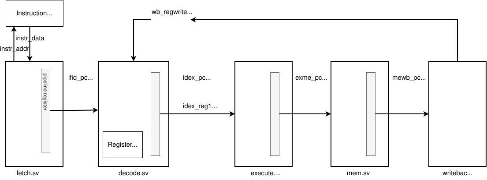

# Phase 3: Pipeline

In this phase, you'll transform your Phase 2 code into a 5 stage pipeline: 

* fetch -- increments the pc and reads the instruction from memory.
* decode -- takes the instruction (32bit binary) value, and decodes it into its individual pieces,  It will then read from the register file, and pass a decoded set of signals to the execute stage.
* execute -- for now, just print out what's input from the decode stage
* memory  -- for now, just print out what's input from the execute stage
* writeback  -- for now, just print out what's input from the memory stage, and set some placeholder values for writing to the register file (in the decode stage)

This is a diagram of the system.  Note, the gray regtangle in each box is labeled pipeline register -- that just represents that in each stage, you'll register values (in an always_ff) block, assigning to the output signals that get passed to the next stage:



The files system_tb.sv, system.sv, and unclocked_ro_mem.sv (the instruction memory) are unchanged from Phase 2.  Also included is a testbench for the instruction memory (unclocked_ro_mem_tb.sv) that you don't need to do anything with, but provided for information.

A new file, regfile.sv is provided to you for the register file code.  Also included is a testbench for the regfile (regfile_tb.sv), that you don't need to do anything with.

The file cpu.sv instantiates the entire pipeline for you.

The files execute.sv, mem.sv, and writeback.sv are all completed for you.

What you'll need to edit are fetch.sv and decode.sv.  For each, you can largely take code from Phase 2 -- in Phase2, the file cpu.sv had code to fetch an instruction from memory and then decode it (then print it out).  That was all done combinatorially.  For Phase 3, split that code up into fetch.sv and decode.sv and pipeline them (register their outputs).  Some comments were placed to help guide you. 

One new logic for Phase 3 is that you need to read from the register file.  In Phase 2, you extracted rs1 and rs2.  In this phase, you'll use those as the address r_addr1 and 2 input to the regfile (see below code which is included in decode.sv for you).  The output of regfile, r_data1 and 2, are what's read from the register file.  Note, you'll then store that in the pipeline register (that is, use an always_ff block and assign the signals to registered outputs of the decode module)
```
// instantiate the register file
    regfile regfile_inst (
        .clk(clk),
        .reset(reset),
        .we(wb_regwrite),
        .w_addr(wb_rd),
        .w_data(wb_writedata),
        .r_addr1(s_id_rs1),
        .r_addr2(s_id_rs2),
        .r_data1(s_id_reg1),
        .r_data2(s_id_reg2)
    );
```
Another thing that changed is the instr_string.  In Phase 2, that was of type string.  In Phase 3, we wanted to set that in decode stage and pass to execute stage for printing.  But, Icarus Verilog doesn't allow strings as ports.  So, instead, we changed to an enum.  We added files instr_strings_pkg.sv (and a testbench for information, instr_strings_pkg_tb.sv).

To use, inside of decode.sv and execute.sv, you'll see this line to import:

```
import instr_strings_pkg::*;
```

Then the declaration of instr_string as:
``` 
instr_op_t instr_string; // note updated type for Phase 3
```

And the input and output ports:

```
// In decode
    output instr_strings_pkg::instr_op_t idex_instr_str
// In execute
    input instr_strings_pkg::instr_op_t idex_instr_str
```

So, you'll need to update the assignment as follows:

```
// Phase 2
instr_string = "add"
// Phase 3
instr_string = OP_ADD
```

In cpu.sv, so hints on how to debug are provided.


## How to Test

We provide an assembly program, sample.S, which tests a few instructions.  We also provide the output from it (sample_log.log).  Note, it runs for longer than the program needs, so you'll see a bunch of lines that you can ignore:

```
pc=0x00000010, instr=0x00000000 (other)
```

The main output, are groups of 4 line, one for each stage.  Note: they will be randomly ordered since they operate in parallel and SystemVerilog can execute them in any order.  Here's sample output from the program, sample.S (looking at time 65).  The actual output is in sample_log_out.log with a cleaned up version in sample_log_out_edit.log.   Note that what's in the decode stage is one instruction (PC=0x10) later than what's in the execute stage (PC=0x0c).

```
(65) Writeback Stage: PC = 00000004, Instruction = 00bf42b3
(65) Memory Stage: PC = 00000008, Instruction = 00d17213
(65) Execute Stage: PC = 0000000c, Instruction = 00f4e493, Reg1 = 000a0009, Reg2 = 000a000f, Immediate = 0000000f, Instruction String = ori
(65) Decode stage: pc=0x00000010, instr=0x00000000 (other)                           
```

You can also note that if you follow a single instruction, say the second instruction (PC=0x04, xor x5, x30, x11), you can see it's in decode at 35, execute at 45, memory at 55, and writeback at 65.

See Phase 2 for how to run and create the init.mem files for different tests.  


You **must** create a new file that is an assembly program that will test more instructions (call it **mytest.S**).  This can be what you used in Phase 2.  Note: you do not need to run the assembly program (e.g., in qemu) to check they do something.  Just, generate the machine code and then run the verilog code.

## AI Use

You need to create a new file AI-use-statement.md and include a statement on how exactly you used AI (tools, prompt examples).

Note -- acceptable uses:
* Learning SystemVerilog -- e.g., provide an example of slicing in SystemVerilog.
* Code completion e.g., if I start typing something and it recognisizes a pattern, it will suggest some code to use that matches that pattern.

Note -- unacceptable uses:
* Asking it to create whole verilog code
* Proving the instructions (or code) from the assignment as asking it to complete all or part.

If in doubt, ask.  


## Submission / Grading

Add any new files you created to the git repo (at least mytest.S), and commit/push all changes.  Do not include temporary files.  We include a .gitignore that should catch these.

Submit the URL in canvas as the submission when you are completed

Rubric:
10 points total

1 point for file AI_use_statement.md

7 points is the output from running the verilog with the program provided (sample.S) works.  
* Code that builds without errors - 1 points (see note)
* Runs with some output - 1 point (see note)
* Fetch stage -- 2 points (each instruction correctly makes it to the decode stage)
* Decode stage - 2 points (each instruction correctly makes it to the memory stage)
* Your test program (mytest.S) compiles without errors - 1 point

2 points are based on an assembly program we wrote (and are not sharing) where we test all instructions.  You get 2 points if works completely correctly, partial credit will be given. 

Note: Since the code we provide will build without erros and produces some output, you must have made a reasonable attempt at completing the assignment to get these 5 points.  We are leaving this as at our discretion to cover cases we don't anticipate (simple things like adding one blank line is clear attempt at just getting these 2 points without doing work).

## File List

### SystemVerilog Code 

Below are the verilog files that make up the whole system

* system.sv -- the top level (instantiates the instruction memory and CPU)
* unclocked_ro_mem.sv -- the instruction memory
* cpu.sv -- the CPU (instantiates the 5 stages of the pipeline)
* fetch.sv -- NEED TO MODIFY -- fetch stage
* decode.sv -- NEED TO MODIFY -- decode stage
* execute.sv -- execute stage
* mem.sv -- memory stage
* writeback.sv -- writeback stage
* instr_strings_pkg.sv -- defines an enum and function for op types
* regfile.sv -- implementation of a register file (used in decode.sv)

### Files useful for testing

* system_tb.sv -- The top level testbench for the system.
* file_list.txt -- list of files for compiling with Icarus Verilog like: iverilog -g2012 -o system_tb.out -c file_list.txt
* make_init_mem.sh -- creates a .mem file used in the instruction memory based on the assembly program you give it.  Copy the resulting file to init.mem to test.  If you have a different setup, you may need to edit this file. 

### Sample Assembly and Output for that Assembly 

* sample.S  -- short assembly program.
* sample_init.mem -- the output of make_init_mem.sh for sample.S.  You can use directly as is by copying to init.mem.
* sample_log_out.log -- the raw output of a simulation run that is correct.
* sample_log_out_edit.log -- an edited log file, adding some spaces and deleting extraneous lines.


### Extra testbenches for some new components

Note: this is not needed for this phase, but in case you are curious, they are included.

* instr_strings_pkg_test.sv
* regfile_tb.sv
